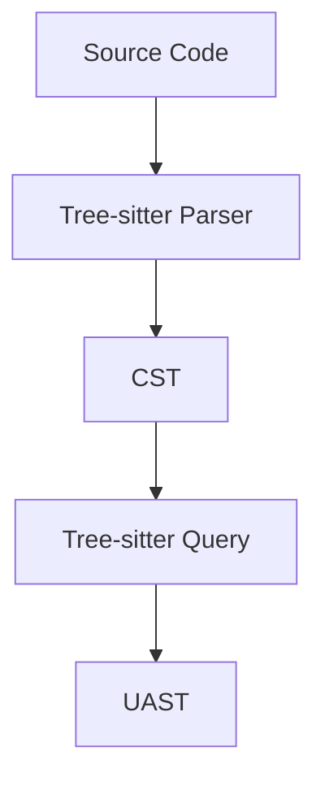

# Chuẩn hóa cấu trúc cây
- Tree-sitter parse ra CST(Concrete Syntax Tree): bao gồm toàn bộ token trong source code
(kể cả các thành phần chỉ mang ý nghĩa cú phấp như `{`, `}`, ...)
- Lượt bỏ bớt các thành phần ngữ pháp, không mang nhiều ý nghĩa => Convert sang AST (Abstract Syntax Tree): 
bỏ anonymous node
- Mỗi grammar(language) lại có các keyword/tupename khác nhau (cùng là hàm, python là `funtion_definition`,
java là `method_definition`) -> chuẩn hóa lại thành UAST(Unified Abstract Syntax Tree)

# Solution

# Query Capture

@definition
- class
- function

@function
- parameters
- return_type

@class
- constructor

@reference
- call
- class

@name

@doc

@comment
